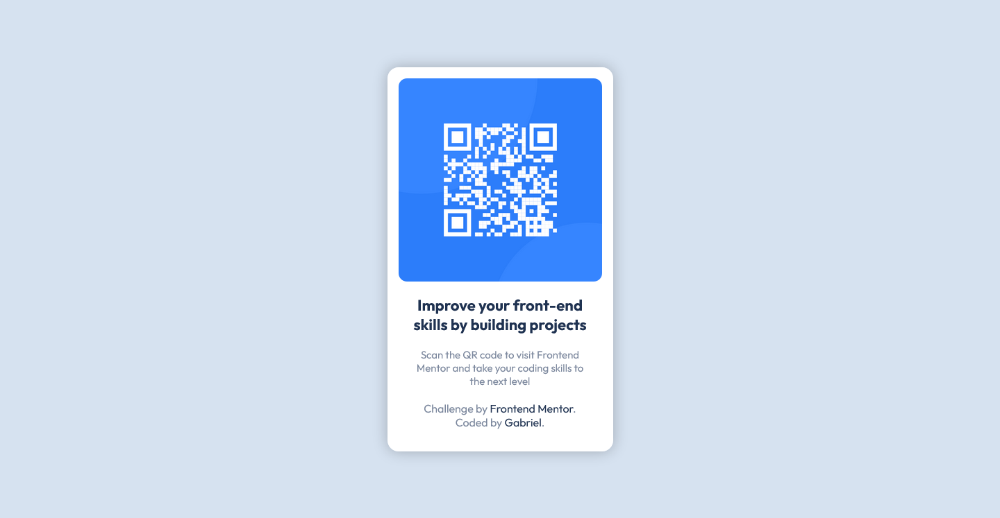

# 💻 QR Code Component | Frontend Mentor

## 📖 Description

This little site was made with *HTML* and *CSS*. The objective was to replicate the design provided by *Frontend Mentor* website. Since the sketch and Figma files are premium only, I used the images and Style Guide provided to make it.

I usually use *flexbox* to center stuff, but since this project is very simple, I wanted to do it in a different way, so I tried to remember how I've done it in the past. Gladly, I remembered it:

```css
left: 50%;
position: absolute;
transform: translate(-50%, -50%);
top: 50%;
```

In this case, I used the `position` property as `absolute`, moved the container to the center of the screen with `left: 50%` and `top: 50%`, and "removed" the remaining space with `translate(-50%, -50%)`. This is only one of the many ways of centering a container.

## 🔨 Technologies

<div style="display: inline-block">
  
  
  
  
</div>

## 🖼️ Image

You can check the project's repository [here](https://github.com/GracilianoOG/fementor-qrcode) or the live preview [here](https://gracilianoog.github.io/fementor-qrcode/).



## 📌 More Info

This was a very simple and fun challenge provided by **Frontend Mentor**.

## 🔗 Links

* [🔍 Frontend Mentor](https://www.frontendmentor.io/home)
* [🔍 QR Code Challenge](https://www.frontendmentor.io/challenges/qr-code-component-iux_sIO_H)
* [🔍 Centering a Container](https://www.freecodecamp.org/news/how-to-center-a-div-with-css-10-different-ways/)