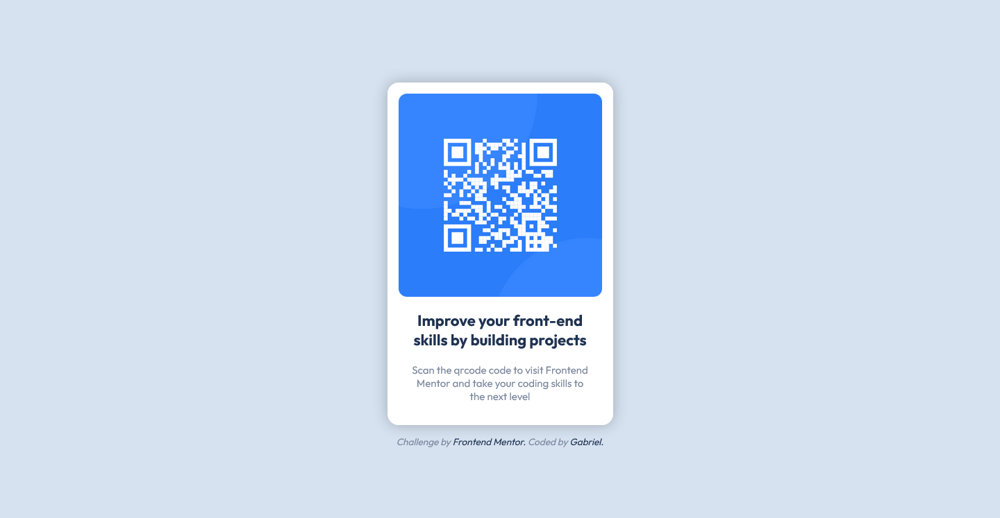

# 💻 QR Code Component | Frontend Mentor

## 📖 Description

This little site was made with *HTML* and plain *CSS*. The objective was to replicate the design provided by *Frontend Mentor* website. Since the sketch and Figma files are premium only, I used the images and Style Guide provided to make it.

## 🔨 Technologies

* HTML
* CSS + Custom Properties
* BEM
* Coded with Visual Studio Code

## 🖼️ Screenshot

You can check the project's [repository here](https://github.com/GracilianoOG/fementor-qrcode) or the live [preview here](https://gracilianoog.github.io/fementor-qrcode/).

## 📌 More Info

This was a very simple and fun challenge provided by **Frontend Mentor**.

## 🔗 Links

* [🔍 Frontend Mentor](https://www.frontendmentor.io/home)
* [🔍 QR Code Challenge](https://www.frontendmentor.io/challenges/qr-code-component-iux_sIO_H)
* [🔍 Centering a Container](https://www.freecodecamp.org/news/how-to-center-a-div-with-css-10-different-ways/)
* [🔍 Removing extra spaces from divs](https://tutorialschools.com/Html/how-to-remove-extra-space-below-image-inside-div)
* [🔍 Address Tag](https://developer.mozilla.org/en-US/docs/Web/HTML/Element/address)
* [🔍 Article Tag](https://developer.mozilla.org/en-US/docs/Web/HTML/Element/article)
* [🔍 Figure Tag](https://developer.mozilla.org/en-US/docs/Web/HTML/Element/figure)